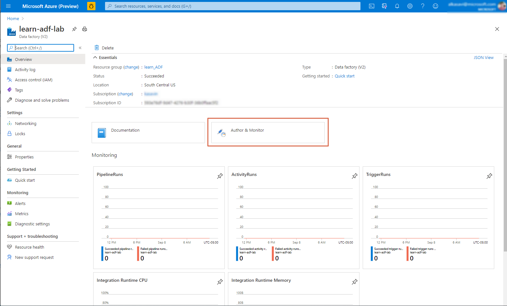

# AzureDataFactoryLab

## Background

A taxi commission for a major city has reached out to you for help. *Their drivers are interested in understanding how to maximize their tips, and the commission has promised them some answers.*

You have a ready-made machine learning model at your disposal that will allow you to submit information about new rides and predict the tip values.

However, before you can use this model to make these prediction (or \"score\" the data), it needs to be cleaned up and transformed.

## Learning Objectives

In this lab, you will learn how to use Azure Data Factory, a no-code tool, to easily prepare your data. At the end of the lab, you will:

- be able to ingest, transform, and output data using Azure Data Factory
- create a pipeline that scores the prepared data
- understand when and how to use Azure Data Factory for other usecases

In a subsequent lab, you will also learn how to prepare the machine learning model that you are using in this lab.

But first, let\'s take a look at the data that you will be using.

## The Data

The commission has made the following data available to you.

- Taxi ride data (two XML files)
 - [[https://adfdemostorageacctbp.blob.core.windows.net/yellow/xml/part-00000.xml]{.underline}](https://adfdemostorageacctbp.blob.core.windows.net/yellow/xml/part-00000.xml)
 - [[https://adfdemostorageacctbp.blob.core.windows.net/yellow/xml/part-00001.xml]{.underline}](https://adfdemostorageacctbp.blob.core.windows.net/yellow/xml/part-00001.xml)
- Payment Lookup
 - [[https://adfdemostorageacctbp.blob.core.windows.net/yellow/lookup/payment\_lookup.csv]{.underline}](https://adfdemostorageacctbp.blob.core.windows.net/yellow/lookup/payment_lookup.csv)
- Zone Lookup
 - [[https://adfdemostorageacctbp.blob.core.windows.net/yellow/lookup/yellow\_zone\_lookup.csv]{.underline}](https://adfdemostorageacctbp.blob.core.windows.net/yellow/lookup/yellow_zone_lookup.csv)

## Getting Started

**Note:** In this lab, a data factory has already been created for you to use. If you are new to Azure Data Factory, you will need to create one in your own Azure subscription by following the steps [[documented in this article]{.underline}](https://docs.microsoft.com/en-us/azure/data-factory/quickstart-create-data-factory-portal).

There are two ways of accessing the data factory.
- From the Azure Portal, select the appropriate Data Factory. Click on the Author & Monitor button pictured below:
	
- Navigate directly to [[https://ms-adf.azure.com/]{.underline}](https://ms-adf.azure.com/). You may need to select your data factory using the dropdown pictured below:
		

 

{width="6.5in"
height="3.6743055555555557in"}

 

The Azure Data Factory landing page provides an overview of the
tool\'s basic capabilities, as well as links to videos and in-depth
tutorials. We encourage you to review some of these tutorials as you
begin to use Azure Data Factory.

 

Click **\\** on the left-hand sidebar, and you\'ll see the three
main categories of actions that you can take within Azure Data
Factory:

{width="3.6041666666666665in"
height="2.6979166666666665in"}

 

 

1.  Author

a.  In this section, you will build sequential activities for your
		data factory to perform.

	i.  Pipelines

	ii. Datasets

	iii. Dataflows

<!-- --

1.  Monitor

a.  In this section, you can review your data factory\'s performance
		on the activities that you established for it in the Author
		section.

<!-- --

1.  Manage

a.  In this section, you can define connection to data stores,
		compute, and source control for your data factory code.

 

 

1.  **Creating Your First Data Factory Pipeline: Converting XML to CSV**

 

The machine learning model will only accept CSV files for scoring. As
a first step, you\'ll need to convert the XML files into CSV files.

 

1.  If you are still on the Linked services screen, click **Author** in
	the left-hand sidebar.

2.  You can create a pipeline in one of several ways.

a.  Click the + sign to open the **Add new resource** menu and
		select **Pipeline**.

b.  Click the ... ellipsis next to **Pipelines** and select **New
		pipeline**.

 

{width="6.5in"
height="3.8368055555555554in"}

 

1.  Either way, your first pipeline will be created, and you will
	automatically see the pipeline authoring canvas.

a.  At left, there will be a list of pipeline **Activities** where
		you will be selecting the pipeline steps.

b.  In the middle, the drag and drop canvas allows you to add and
		link these activities.

c.  On the right, the pipeline **Properties** allows you to name and
		describe this pipeline.

 

{width="6.5in"
height="4.155555555555556in"}

 

1.  Add a descriptive name for this pipeline - such as
	\"nyctaxiyellow\_xml\_csv\_pl\" - and close the properties by
	clicking the icon above the **Properties** section.

2.  To add your first pipeline activity, click on the **Move &
	transform** category under **Activities**.

3.  Drag and drop the **Copy data** activity onto the canvas, as
	pictured below.

4.  When you drag an activity onto the canvas, a configuration panel
	below the canvas will automatically expand.

 

{width="6.5in"
height="4.161111111111111in"}

 

1.  Configure your pipeline.

a.  As before, on the **General** tab, give your pipeline a
		descriptive name, such as \"Copy convert xml to csv.\"

b.  Leave the rest of the default setting on the **General** tab.

c.  Click on the **Source** tab.

	i.  Source and sink are key concepts in Azure Data Factory. They
			refer to the source of your data, and the destination for
			your data once it has been transformed.

	ii. Click **+ New** to configure your source dataset.
			Connections to data sources have been configured for you;
			you need to do is select the appropriate *dataset* from
			the source.

	iii. On the panel/blade that opens, select **Azure Blob
			Storage** and click **Continue**.

 

{width="6.4118055555555555in"
height="8.614583333333334in"}

1.  On the next panel/blade that opens, called **Select format**, choose
	**XML** and click **Continue**.

{width="5.9222222222222225in"
height="8.052083333333334in"}

i.  Give this dataset a descriptive name, such as
	\"Yellowcab\_XML\_Data.\" In the **Linked service** dropdown,
	select the \"Yellowcab\_Source\_Files\" data source.

1.  Once you select the data source, you may be asked to
		re-authenticate into Azure.

2.  If you know the name of the storage container and folder, enter
		them into the **File path**; if not, you can click the folder
		icon and navigate to the right container and folder.

	a.  Container: yellow

	b.  Folder: xml

<!-- --

1.  Because you\'ll be working with multiple files in the same
		folder, you\'ll need to set up a **wildcard file path**:

2.  Disable **Recursively** and **Namespaces**.

<!-- --

i.  Click on the **Sink** tab.

1.  Just as you configured the source data, you will need to
		configure where the CSV files are written to and stored.

2.  Click **+ New**.

3.  On the panel/blade that opens, select **Azure Blob Storage** and
		click **Continue**.

4.  On the **Select format** panel/blade, select
		**CSV/DelimitedText** and click **Continue**.

5.  As before, give this dataset a descriptive name, such as
		\"Yellowcab\_CSV\_Data.\" In the **Linked service** dropdown,
		select the \"Yellowcab\_Source\_Files\" data source you used
		above.

	a.  Once you select the data source, you may be asked to
			re-authenticate into Azure.

	b.  Click **OK**.

<!-- --

1.  The **Sink dataset** dropdown will now read
		\"Yellowcab\_CSV\_Data.\"

2.  Click **Open** to the right of the dropdown to configure this
		sink further.

	a.  In the **File path**, click on **Container** and select
			**Add dynamic content** below this field.

{width="6.5in"
height="4.152083333333334in"}

i.  This will open a blade called **Add dynamic content.**

1.  Click the **+** button next to the search filter.

2.  Create three new parameters, each of which is a string:

	a.  containername

	b.  foldername

	c.  foldername\_initial\_bdyyyy

<!-- --

1.  Click on the newly-created containername parameter. It will
		populate the first field on the page. Click **Finish** to
		return to the dataset settings configuration.

2.  Repeat the process by adding the foldername parameter to the
		**Directory** field. Here you will add the following
		concatenation:

	a.  \@concat(dataset().foldername,\'/\',dataset().foldername\_initial\_bdyyyy)

<!-- --

1.  Click **Finish** to see the result below:

2.  {width="6.5in"
		height="0.42430555555555555in"}

<!-- --

i.  Select **First row as header**.

<!-- --

i.  Return to the data factory pipeline tab. You\'ll now see the
	following fields in your **Sink** settings.

 

{width="6.5in"
height="3.598611111111111in"}

 

1.  Set **containername** to \"yellow\"

2.  Set **foldername** to \"csv\"

3.  Set **foldername\_initial\_bdyyy** to your initials and birth year,
	such as \"AB\_1970\"

4.  Set **File extension** to \".csv\"

<!-- --

1.  Click the **Mapping** tab.

i.  Click **Import schemas**. This will bring in the data formatting
		from the XML files in order to create a mapping for the CSV
		columns.

ii. Check the **Collection reference** box on the **record** row.

iii. As you review the columns that will be created, change each
		data **Type** to String.

	1.  It may strike you as odd when some of the column will
			clearly be numerical values or other data types. We will
			be working with datatype conversions later in the lab, but
			if you know the data you are working with, you can
			certainly make these designations here.

<!-- --

1.  You are now ready to **Validate** your first pipeline!

i.  Click the Validate button above the canvas.

ii. Ideally, the **Pipeline validation output** will read \"Your
		pipeline has been validated. No errors were found.\"

iii. If you do see an error, please reach out to one of the lab
		coaches for assistance.

<!-- --

1.  After validating, click the **Publish all** button to save your
	changes to both the pipeline and the datasets. Click **Publish**
	on the **Publish all** blade that appears.

 

{width="6.5in"
height="8.965277777777779in"}

 

1.  Now that you\'ve published your datasets and pipeline, you can test
	the pipeline in real-time. Click the **Debug** button above the
	canvas to begin pipeline run.

i.  A pipeline run status will appear below the canvas. Once you see
		a green check mark and the **Succeeded** status, you can hover
		over the pipeline run and click on the glasses for a detailed
		view.

 

{width="6.5in"
height="3.3666666666666667in"}

 

1.  The **Details** popup will tell you about the pipeline run,
	including how much data was read, how much data was written, and
	the speed of the pipeline.

 

{width="6.5in"
height="3.957638888888889in"}

 

a.  You can also view the storage location that you designated in the
	**Sink** settings to confirm that the files have been saved as
	expected. You should now see two CSV files in the yellow/CSV
	directory!

 

I.  **Import your Dataset Schema **

 

1.  For the next pipeline, you\'ll be working with the specific data in
	the CSV files that you\'ve created. To do that effectively, you
	will need the data schema.

2.  Select the Yellowcab\_CSV\_Data dataset under **Factory Resources
	-\ Datasets**, and click the **Schema** tab.

 

{width="6.5in"
height="2.842361111111111in"}

 

1.  Click **Import schema** and select **From files with \'\*.csv\'**.

 

{width="4.802083333333333in"
height="4.5in"}

 

1.  Verify the parameter settings in the panel/blade that opens, and
	click **OK**.

 

{width="4.963888888888889in"
height="6.927083333333333in"}

 

1.  You should now see the columns and data types as shown below. If you
	recall, we designated all of the columns as strings in a prior
	step.

 

{width="4.739583333333333in"
height="5.916666666666667in"}

 

1.  You can now use this schema in the data flow you\'ll create in the
	next section.

 

I.  **Creating Another Data Factory Pipeline: Working with Data Flows**

 

1.  Create a new pipeline under **Factory Resources**. As a reminder,
	you can do this in one of two ways:

a.  Click the + sign to open the **Add new resource** menu and
		select **Pipeline**.

b.  Click the ... ellipsis next to **Pipelines** and select **New
		pipeline**.

<!-- --

1.  Name your new pipeline \"nyctaxiyellow\_dataflow\_pl.\"

2.  As before, click on the **Move & transform** category under
	**Activities**.

3.  This time, drag and drop the **Data flow** activity onto the canvas.

4.  A panel/blade called **Adding data flow** will open automatically.

 

{width="6.5in"
height="3.8534722222222224in"}

 

1.  Select **Create a new data flow**.

2.  Select **Mapping Data Flow** and click OK.

a.  To learn about the two different types of data flows, visit the
		overviews linked below in the Resources section.

<!-- --

1.  You will automatically be taken to the data flow canvas, with a
	prompt to enter your first data source.

 

{width="6.5in"
height="2.1430555555555557in"}

 

1.  Give your dataflow a descriptive name like \"nyctaxi\_yellow\_df\"
	and close the **Properties** tab.

2.  Click on the **Add Source** box, and you\'ll see a quick walkthrough
	that explains how data flows work.

 

{width="6.5in"
height="3.3854166666666665in"}

 

1.  The three data sources you\'ll be using in this data flow are:

a.  the CSV output from the prior data flow

b.  payments lookup data

c.  zone lookup data

<!-- --

1.  Configure your first data source to look like the screenshot below:

a.  **Output stream name:** YellowTrip

b.  **Source type:** Dataset

c.  **Dataset**: Yellowcab\_CSV\_Data

 

{width="6.5in"
height="3.5319444444444446in"}

 

1.  Click on the **Projection** tab. You will see the data schema
	imported in the prior section. Here, you can modify the data
	types. Specify the following data types:

 

{width="4.8805555555555555in"
height="6.677083333333333in"}

 

1.  You can then click the **Data preview** tab to preview your data.

2.  Now that you\'ve configured the source, you\'re ready to work with
	your data. Click the small + sign at the bottom right of your data
	source on the canvas. You will see a list of transformation
	options.

 

{width="4.15625in"
height="6.4847222222222225in"}

 

 

1.  Select **Derived Column**. Each transformation will have its own
	settings and configuration options.

a.  Give your **Output stream name** a name, such as
		\"DerivedColumns.\"

b.  The **Incoming stream** will auto-populate with the name of the
		source you specified above.

 

{width="6.5in" height="1.9625in"}

 

1.  Under **Columns**, add the following columns and expressions,
	clicking + after each one.

 

**Column**                **Expression**
------------------------- ----------------------------------------------------------------------------------------------------------------------------------------------------------------------------------------------------------------------------------------------------------
Vendor\_abbreviation      iif(vendor\_id==1,\'CMT\',iif(vendor\_id==2,\'VTS\',\'DDS\'))
Vendor\_description       iif(vendor\_id==1,\'Creative Mobile Technologies, LLC\',iif(vendor\_id==2,\'Verifone Inc.\',\'Digital Dispatch Systems\'))
Pickup\_datetime          toTimestamp(pickup\_datetime,\'yyyy-MM-dd HH:mm:ss\',\'EST\')
Dropoff\_datetime         toTimestamp(dropoff\_datetime,\'yyyy-MM-dd HH:mm:ss\',\'EST\')
Rate\_code\_description   iif(rate\_code\_id==1, \'Standard Rate\',iif(rate\_code\_id==2,\'JFK\',iif(rate\_code\_id==3,\'Newark\',iif(rate\_code\_id==4,\'Nassau or Westchester\',iif(rate\_code\_id==5,\'Negotiated fare\',iif(rate\_code\_id==6,\'Group ride\',\'Unknown\'))))))
Pickup\_year              year(toTimestamp(pickup\_datetime,\'yyyy-MM-dd HH:mm:ss\',\'EST\'))
Pickup\_month             month(toTimestamp(pickup\_datetime,\'yyyy-MM-dd HH:mm:ss\',\'EST\'))
Pickup\_day               dayOfMonth(toTimestamp(pickup\_datetime,\'yyyy-MM-dd HH:mm:ss\',\'EST\'))
Pickup\_hour              hour(toTimestamp(pickup\_datetime,\'yyyy-MM-dd HH:mm:ss\',\'EST\'))
Dropoff\_year             year(toTimestamp(dropoff\_datetime,\'yyyy-MM-dd HH:mm:ss\',\'EST\'))
Dropoff\_month            month(toTimestamp(dropoff\_datetime,\'yyyy-MM-dd HH:mm:ss\',\'EST\'))
Dropoff\_day              dayOfMonth(toTimestamp(dropoff\_datetime,\'yyyy-MM-dd HH:mm:ss\',\'EST\'))
Dropoff\_hour             hour(toTimestamp(dropoff\_datetime,\'yyyy-MM-dd HH:mm:ss\',\'EST\'))

 

1.  If you click on **Inspect**, you can see the new columns that will
	be created. **Data preview** will show you a selection of the data
	in those columns.

2.  Click the + sign at the bottom-left of your newly-created
	DerivedColumns step, and select **Join**.

3.  You\'ll see another set of configuration options for the Join.
	Change the name to \"PaymentJoin.\"

 

{width="6.5in"
height="4.4743055555555555in"}

 

1.  In order to complete this join, you\'ll need to add another data
	source. The **Left stream** will default to the output from the
	prior step. Tp set up the **Right stream**, you\'ll need to click
	**Add Source**.

a.  A new set of **Source settings** will appear.

b.  Call this **Output stream name** \"PaymentLookup.\"

c.  This **Dataset** will not yet appear in the dropdown, so you\'ll
		need to click **+ New** and add it.

	i.  On the **New dataset** blade, select **Azure Blob Storage**
			and click **Continue**.

	ii. Choose **CSV/DelimitedText** as the file format, and click
			**Continue**.

	iii. Edit the properties on the **Set properties** blade and
			click **OK.**

		1.  **Name**: \"Payment\_Lookup\_Data\"

		2.  **Linked service:** do not change

		3.  **File path**: yellow / lookup / payment\_lookup.csv

 

{width="6.375in"
height="3.2291666666666665in"}

 

1.  Click on the **Projection** tab and change the \"payment\_type\" to
	short.

2.  Preview the data by clicking on **Data preview**.

<!-- --

1.  With the new data source ready, click back on the **Join** segment
	of the data flow. You will now see the PaymentLookup data source
	in the **Right stream** dropdown.

 

{width="4.65625in"
height="1.8020833333333333in"}

 

1.  Select payment\_type in both dropdowns - the **Left:
	DerivedColumns\'s column** and in **Right: PaymentLookup\'s
	column**. This determines the column on which the two source
	tables will be joined.

2.  Your next step will be another **Join**. For this one, let\'s set up
	the data source first. Click **Add Source** on the data flow
	canvas.

3.  As before, you\'ll need to configure this data source. Name it
	\"ZoneLookup\" and click the **+ New** button next to **Dataset**.

a.  Select **Azure Blob Storage** and click **OK**.

b.  Select **CSV/DelimitedText** and click **Continue**.

c.  Edit the properties on the **Set properties** blade and click
		**OK.**

	i.  **Name**: \"Zone\_Lookup\_Data\"

	ii. **Linked service**: Yellowcab\_Source\_Files

	iii. **File path:** yellow / lookup / yellow\_zone\_lookup.csv

	iv. **Import schema:** From connection/store

<!-- --

a.  Click the **Projection** tab and change the location\_id data
		**Type** to short.

<!-- --

1.  Next, click the + below the **PaymentJoin** block in the canvas, and
	select **Join** again.

 

{width="6.5in"
height="2.973611111111111in"}

 

1.  Configure this **Join** using the settings below:

a.  **Output stream name:** PickupZoneJoin

b.  **Left stream:** PaymentJoin

c.  **Right stream:** ZoneLookup

d.  **Join conditions:** pickup\_location\_id == location\_id

<!-- --

1.  The next step you\'ll add is a **Select** step.

 

{width="6.5in"
height="2.7243055555555555in"}

 

1.  Change the **Output stream** name to \"RenamePickupZoneCols.\"

2.  Add another **Join**, repeating the steps above but with the
	following settings changed:

a.  **Output stream name:** DropoffZoneJoin

b.  RenamePickupZoneCols

c.  **Right stream:** ZoneLookup

d.  **Join conditions:** dropoff\_location\_id == location\_id

<!-- --

1.  Add another **Select** step. Rename it \"RenameDropoffZoneCol.\"

a.  Remove the following columns from your mapping:

	i.  pickup\_datetime

	ii. dropoff\_datetime

	iii. pickup\_location\_id

	iv. dropoff\_location\_id

	v.  pickup\_longitude

	vi. pickup\_latitude

	vii. dropoff\_longitude

	viii. dropoff\_latitude

	ix. location\_id (*Make sure to remove both.*)

<!-- --

a.  Rename the last six columns to avoid a naming clash between
		borough, zone, and service\_zone columns:

 

{width="6.5in"
height="1.3402777777777777in"}

 

 

 

 

1.  You\'re almost done!

2.  We will need to configure a destination for the data that is
	transformed. Your list of **Factory Resources** has grown. Click
	the ... ellipses next to **Datasets** and select **New dataset**.

 

{width="4.4375in" height="4.25in"}

 

1.  Configure the new dataset.

a.  Select **Azure Blob Storage** and click **Continue**.

b.  Select **CSV/DelimitedText** and click **Continue**.

c.  On the **Set properties** blade:

	i.  **Name**: Dataflow\_Sink\_CSV

	ii. **Linked service**: Select the one you\'ve been using

<!-- --

a.  On the **Connection** tab, you\'ll need to configure the **File
		path** using dynamic parameters similar to the ones you\'ve
		configured before. Your settings should ultimately look like
		the settings below:

 

{width="6.5in"
height="4.365277777777778in"}

 

 

 

1.  Return to your dataflow canvas and click the **+** sign one more
	time, and select **Destination -\ Sink**. A sink is the
	destination for your data once you\'ve completed all of these
	transformation steps.

a.  On the **Sink** tab, configure the following settings:

	i.  Output **stream name**: DataflowSinkCSV

	<!-- --

	i.  **Dataset**: Dataflow\_Sink\_CSV (the dataset you created
			above should be available in the dropdown)

<!-- --

a.  On the **Settings** tab, configure the following settings:

	i.  **Clear the folder:** ON

	ii. **File name option**: Output to single file

		1.  You may see an error here that asks you to Set single
				partition. If you do, click that button before
				proceeding.

	<!-- --

	i.  **Output to single file**: nyctaxiyellow\_final.csv

<!-- --

1.  Finally, return to the nyctaxiyellow\_dataflow\_pl pipeline.

2.  Click on the **Mapping Data Flow** block on the canvas, and
	configure the **Settings** to reflect the containername,
	foldername, and

initials\_birthyear information.

1.  Click **Validate all** above the dataflow canvas to check your work.

a.  If you receive any error messages, please check in with one of
		your coaches.

<!-- --

1.  Click **Publish all**, review the publication changes in the blade,
	and click **Publish** to save your work.

a.  If you receive any error messages, please check in with one of
		your coaches.

<!-- --

1.  Click **Debug** above the pipeline canvas. The pipeline will be
	deployed, and you will receive a status update as with the prior
	pipeline.

 

{width="6.5in"
height="2.216666666666667in"}

 

1.  Hover over the pipeline run and select the eyeglass icon. You will
	see an overview of the dataflow, including the status at every
	step.

 

{width="6.5in"
height="3.7159722222222222in"}

 

 

I.  **Creating the Final Data Factory Pipeline: Machine Learning**

 

1.  Return to the **Factory Resources** pane and create another
	pipeline. Name it \"nyctaxiyellow\_ml\_scoring\_pl.\"

2.  In the **Activites** pane, expand **Machine Learning** and drag the
	third option, **Machine Learning Execute Pipeline**, onto the
	canvas.

 

 

 

 

 

 

 

 

 

 

 

 

 

 

 

**Additional References**

1.  [[Introduction to Azure Data
	Factory]{.underline}](https://docs.microsoft.com/en-us/azure/data-factory/introduction)

2.  [[Mapping data flows in Azure Data
	Factory]{.underline}](https://docs.microsoft.com/en-us/azure/data-factory/concepts-data-flow-overview)

3.  [[Wrangling data flows in Azure Data
	Factory]{.underline}](https://docs.microsoft.com/en-us/azure/data-factory/wrangling-data-flow-overview)

 
